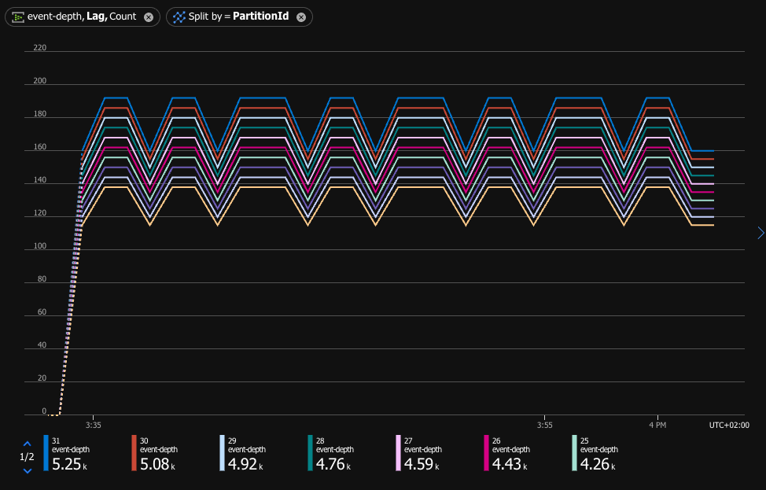

# Custom-Metrics-Emitter

This sample project show how to implement sending a custom metric events to Azure Event Hub. Specifically, we will calculate the unprocessed events (The Lag) of specific consumer group in event hub. This metric is not available in event hub standard metrics for now. More about custom metrics in Azure Monitor check [this article](https://learn.microsoft.com/en-us/azure/azure-monitor/essentials/metrics-custom-overview)


## Table of Contents
- [Overview](#overview)
- [High-Level Solution Concept](#high-level-solution-concept)
- [Custom Metric](#custom-metric)
- [Step by step deployment](#step-by-step-deployment)
  - [Pre-requisite](#pre-requisite)
  - [Deploying the solution](#deploying-the-solution)
  - [Configuring Bicep to deploy the solution](#configuring-bicep-to-deploy-the-solution)
- [Build and Publish](#build-and-publish)

## Overview

When using Azure Event Hub, it is important to monitor the lag of the consumer group. This is the number of events that have been sent to the event hub but have not yet been processed by the consumer group. This is important to monitor as it can indicate if the consuming applications are able to address the load of the event hub. If the lag is increasing, it may indicate that the consuming applications are not able to keep up with the load of the event hub.

> This metric is not available in event hub standard metrics for now.


## High-Level Solution Concept


The solution will create the required resources and deploy the solution on Azure Container App. The solution will run as a container and will send a custom metric to Azure Monitor. The custom metric will include the following dimensions:

- Eventhub name (the topic)

- Consumer group name

- Partition ID

The resources that will be created are:

- Azure Contianer App Environment - this is the environment which will host the solution

- Azure Container App - this is the container which will run the solution

- Managed Identity - this is the identity which will be used by the container app to authenticate to Azure Event Hub and Azure Storage

- Role assignments - this is the role assignments which will be assigned to the managed identity to allow it to read the checkpoints from Azure Storage and send the custom metric to Azure Monitor

### Custom Metric

Example of json schema which send a custom metric can be found [here](test/custom1.json)
As the schema also include the partition number as one of the dimensions - we can have a view of unprocessed events per partition:



## Step by step deployment 

This solution is aimed for customers/users who already have an Azure Event Hub and want to monitor the lag of a specific consumer group. Please follow the pre-requisites below before deploying the solution. The users running the solution will need to have the Contributor role on the resource group where the solution is deployed. (at least)

The image for this solution was build using GitHub Action. The code is [here](.github/workflows/ghcr_build_push.yml), it leverages the ghcr as the container registry. The image is available ```docker pull ghcr.io/yodobrin/custom-metrics-emitter:latest``` 

### Pre-requisite
1. Deploy the following Azure services:
   1.  Azure Event Hub
   2.  Azure Storage
   3.  Azure Application Insights (optional)
2. Producer and Consumer sample application for Azure Event hub [code example](https://learn.microsoft.com/en-us/azure/event-hubs/event-hubs-dotnet-standard-getstarted-send?tabs=passwordless%2Croles-azure-portal)

### Deploying the solution

1. Clone this repository to a local directory

2. Navigate to the directory where the repository was cloned, and to deploy/bicep folder

3. Modify the params.json file to include the required parameters for the deployment (see below for more details)

4. Run the following command to deploy the solution:

   `az deployment group create --resource-group <resource group name> --template-file main.bicep --parameters @params.json`

5. Once completed successfully, the solution will be deployed and running.


#### Configuring Bicep to deploy the solution

The solution can be deployed using Bicep, the following files are included:

- `main.bicep` - main bicep file which deploy the solution

- `parameters.json` - parameters file which include the required parameters for the deployment

- `aca.bicep` - bicep file which deploy the Azure Container App

- `roles.bicep` - bicep file which deploy the required roles for the solution

The following parameters should be set, these are subset of the environment variables which need to be set when running the docker image. The other items are either derived or created during the deployment process.

- EventHubNamespace - This is the namespace of your eventhub

- EventHubName - This is the name of your eventhub you wish to monitor within the namespace

- CheckpointAccountName - This is the name of the storage account where the checkpoints are stored

- CheckpointContainerName - This is the name of the container within the storage account where the checkpoints are stored

- CustomMetricInterval - an optional value, this is the interval in milliseconds between each metric being sent to Azure Monitor. 

- managedIdentityName - As part of the deployment, a user assigned managed identity will be created. This is the name of that identity. It will be used as the identity for the container app. This identity will be granted the required roles for the solution to work. These are the roles:

  - `Monitoring Metrics Publisher` role for Azure Event Hub

  - `Azure Event Hubs Data Owner` role for Azure Event Hub

  - `Storage Blob Data Reader` for Azure Storage


## Build and Publish - SHOULD WE INCLUDE THIS?

If you wish to modify this solution, it can be deployed on either Azure Container App or any other Azure service which able to host container solution and has User Managed Identity support (in case this is the selected authentication method - see above).

1. Build and Publish a docker image, in the sample - we are building and publishing the image using Github action which trigger once a new release created.
2. Deploy the solution on the chosen Azure Service, in the sample - we are using Azure Container App, 
   - if the chosen authentication method is User Managed Identity - assign the identity to the service.
   - The following environemnt variables should be set:
     - `TenantId`             - { Tenant Id of Azure Subscription }
     - `SubscriptionId`          - { Azure Subscription Id }
     - `ResourceGroup`            - { Resource Group name where the Azure Event Hub deployed }
     - `Region`                   - { Region name where the Azure Event Hub deployed }
     - `EventHubNamespace`        - { Name of Azure Event Hub Namespace}
     - `EventHubName`             - { Name of Azure Event Hub }
     - `ConsumerGroup`            - { Consumer Group which need to be monitored }
     - `CheckpointAccountName`    - { Azure Storage name of checkpoint }
     - `CheckpointContainerName`  - { Container name which the consumer update }      
     - `CustomMetricInterval` (optional) - { Metric send interval in ms, default: 10000ms }
     - `ManagedIdentityClientId` (optional) - { User Managed Identity client id in case of managed identity authentication}
     - `AZURE_TENANT_ID` (optional) - {tenand Id in case of service principal authentication }
     - `AZURE_CLIENT_ID` (optional) - {spn client id in case of service principal authentication }
     - `AZURE_CLIENT_SECRET` (optional) - { spn client secret in case of principal authentication }
     - `APPLICATIONINSIGHTS_CONNECTION_STRING` (optional) - Azure Application Insights connection string

Example of running the docker image locally:

`docker run -d -e EventHubNamespace="{EventHubNamespace}" -e Region="{Region}" -e SubscriptionId="{SubscriptionId}" -e ResourceGroup="{ResourceGroup}" -e TenantId="{TenantId}"  -e EventHubName="{EventHubName}" -e ConsumerGroup="{ConsumerGroup}" -e CheckpointAccountName="{CheckpointAccountName}" -e CheckpointContainerName="{CheckpointContainerName}" -e CustomMetricInterval="{CustomMetricInterval}" -e ManagedIdentityClientId="{ManagedIdentityClientId}" -e APPLICATIONINSIGHTS_CONNECTION_STRING="{APPLICATIONINSIGHTS_CONNECTION_STRING}" -e AZURE_TENANT_ID={AZURE_TENANT_ID} -e AZURE_CLIENT_ID={AZURE_CLIENT_ID} -e AZURE_CLIENT_SECRET={AZURE_CLIENT_SECRET}  <dockerimagename>`